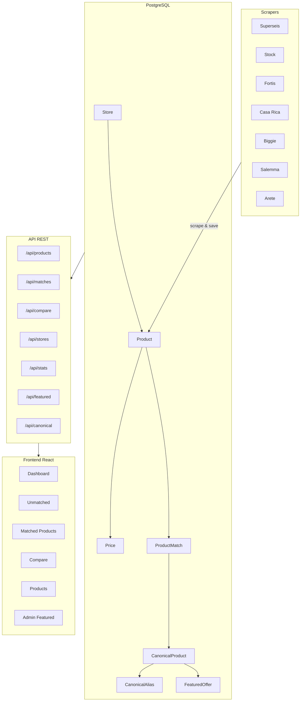
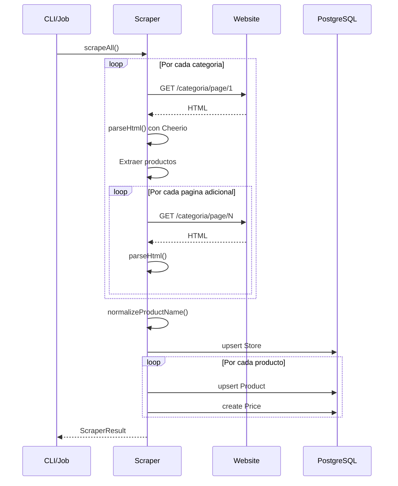
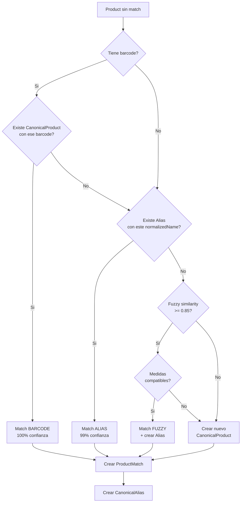
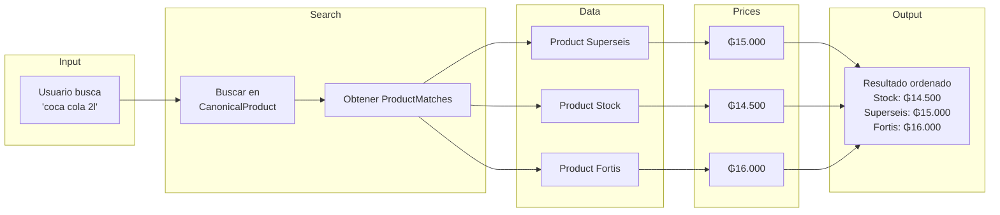
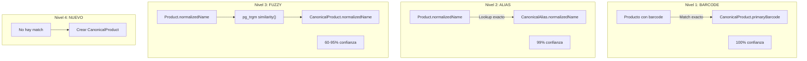
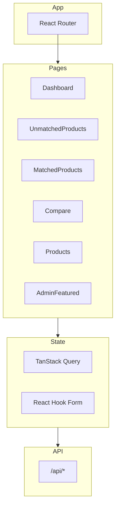
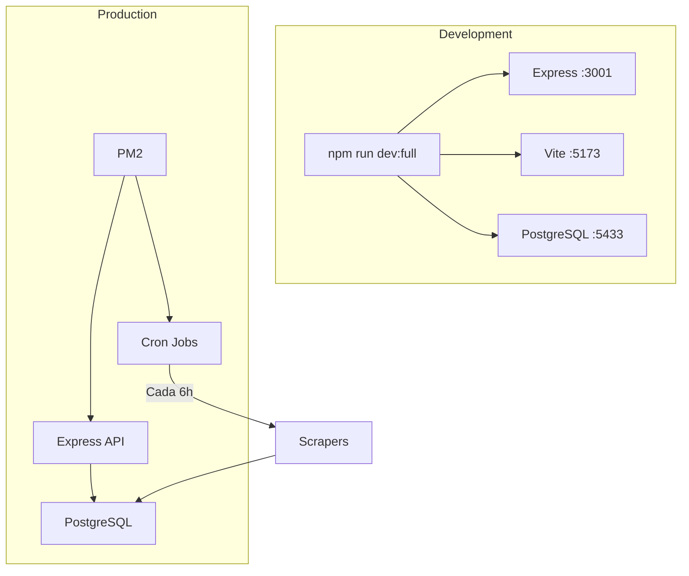

# Diagramas de Arquitectura

## Arquitectura General



## Diagrama ER - Base de Datos

```mermaid
erDiagram
    Store ||--o{ Product : "has many"
    Store ||--o{ Price : "has many"
    Product ||--o{ Price : "has many"
    Product ||--o| ProductMatch : "has one"
    CanonicalProduct ||--o{ ProductMatch : "has many"
    CanonicalProduct ||--o{ CanonicalAlias : "has many"

    Store {
        uuid id PK
        string name UK
        string slug UK
        enum type
        string logoUrl
        string websiteUrl
        boolean isActive
        datetime lastScrapedAt
    }

    Product {
        uuid id PK
        string name
        string normalizedName
        string baseNormalizedName
        string brand
        string category
        string unit
        float quantity
        string barcode
        string externalId
        string imageUrl
        boolean isHidden
        uuid storeId FK
    }

    Price {
        uuid id PK
        decimal price
        decimal oldPrice
        string currency
        string sourceUrl
        datetime scrapedAt
        uuid productId FK
        uuid storeId FK
    }

    CanonicalProduct {
        uuid id PK
        string name
        string displayName
        string normalizedName UK
        string baseNormalizedName
        string brand
        string category
        float quantity
        string unit
        string primaryBarcode UK
    }

    ProductMatch {
        uuid id PK
        enum matchType
        float confidence
        boolean isVerified
        uuid productId FK UK
        uuid canonicalProductId FK
    }

    CanonicalAlias {
        uuid id PK
        string normalizedName UK
        uuid canonicalProductId FK
    }

    FeaturedOffer {
        uuid id PK
        uuid canonicalProductId FK UK
        int displayOrder
        boolean isActive
        datetime createdAt
        datetime updatedAt
    }

    CanonicalProduct ||--o| FeaturedOffer : "has one"
```

## Flujo de Scraping



## Flujo de Matching



## Flujo de Comparacion de Precios



## Niveles de Matching



## Arquitectura de Componentes Frontend



## Diagrama de Deployment


