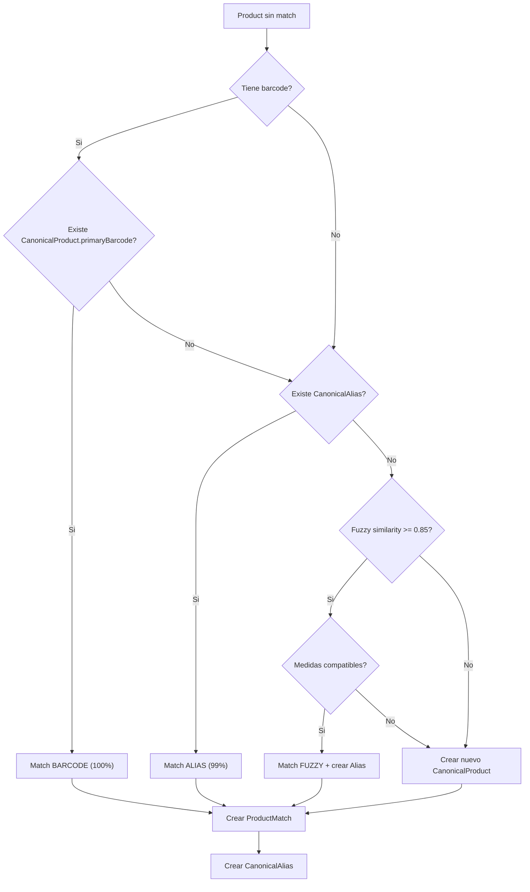

# Sistema de Matching en Base de Datos

## Conceptos Clave

### Product vs CanonicalProduct

| Aspecto | Product | CanonicalProduct |
|---------|---------|------------------|
| Representa | Producto en UNA tienda | Producto "real" unico |
| Cantidad | Muchos (uno por tienda) | Uno por producto real |
| Nombre | Varia por tienda | Nombre canonico |
| Precio | Tiene historial de precios | No tiene precio |

**Ejemplo:**
```
CanonicalProduct: "Coca-Cola Original 2L"
  └── ProductMatch ──> Product (Superseis): "COCA COLA ORIGINAL 2LT"    ₲15.000
  └── ProductMatch ──> Product (Stock): "Coca Cola Original 2 Litros"   ₲14.500
  └── ProductMatch ──> Product (Fortis): "COCA-COLA ORG. 2L"            ₲16.000
```

### normalizedName vs baseNormalizedName

| Campo | Descripcion | Ejemplo |
|-------|-------------|---------|
| `normalizedName` | Nombre completo normalizado | "coca cola original 2l" |
| `baseNormalizedName` | Nombre SIN cantidad/unidad | "coca cola original" |

**Por que baseNormalizedName?**

El matching fuzzy puede fallar cuando los numeros difieren ligeramente:
- "coca cola 2l" vs "coca cola 2000ml" → baja similitud por "2l" vs "2000ml"

Con `baseNormalizedName`:
- "coca cola" vs "coca cola" → alta similitud
- Luego se valida que quantity y unit sean compatibles

---

## Modelos de Matching

### ProductMatch

```prisma
model ProductMatch {
  id         String    @id
  matchType  MatchType
  confidence Float           // 0.0 - 1.0
  isVerified Boolean   @default(false)

  product   Product @relation(...)
  productId String  @unique    // Un Product solo tiene UN match

  canonicalProduct   CanonicalProduct @relation(...)
  canonicalProductId String
}
```

**matchType:**
- `BARCODE`: Match por codigo de barras identico
- `ALIAS`: Match por nombre en tabla de alias
- `FUZZY`: Match por similitud de texto
- `MANUAL`: Match creado por usuario

**confidence:**
- `1.0`: BARCODE o MANUAL (100% seguro)
- `0.99`: ALIAS (99% seguro)
- `0.60 - 0.95`: FUZZY (depende de similitud)

### CanonicalAlias

```prisma
model CanonicalAlias {
  id             String @id
  normalizedName String @unique  // Nombre normalizado

  canonicalProduct   CanonicalProduct @relation(...)
  canonicalProductId String
}
```

**Proposito:**
Cache de nombres conocidos para evitar fuzzy search repetido.

**Flujo:**
1. Producto nuevo "coca cola original 2l" sin match
2. Fuzzy match encuentra CanonicalProduct "Coca-Cola Original 2L"
3. Se crea ProductMatch
4. Se crea CanonicalAlias: "coca cola original 2l" → CanonicalProduct
5. Proximo producto con mismo normalizedName → match instantaneo por ALIAS

---

## Flujo de Matching



---

## Validacion de Medidas

Cuando se hace fuzzy matching, se validan las medidas para evitar matches incorrectos.

### Reglas de Compatibilidad

```typescript
function areMeasurementsCompatible(
  qty1, unit1,  // Product
  qty2, unit2   // CanonicalProduct
): boolean {
  // Ambos sin medida → compatible
  if (qty1 === null && qty2 === null) return true

  // Uno con medida, otro sin → NO compatible
  if ((qty1 === null) !== (qty2 === null)) return false

  // Normalizar unidades
  // l → ml (*1000), kg → g (*1000)

  // Comparar con tolerancia del 1%
  return Math.abs(normalizedQty1 - normalizedQty2) <= tolerance
}
```

### Ejemplos

| Product | CanonicalProduct | Compatible? |
|---------|------------------|-------------|
| 2l | 2l | Si |
| 2l | 2000ml | Si (equivalente) |
| 500g | 0.5kg | Si (equivalente) |
| 2l | 1.5l | **No** |
| 2l | null | **No** |
| null | null | Si |

---

## Queries Utiles

### Productos sin match
```sql
SELECT p.*
FROM "Product" p
LEFT JOIN "ProductMatch" pm ON pm."productId" = p.id
WHERE pm.id IS NULL;
```

### Productos matcheados por tienda
```sql
SELECT
  s.name as store,
  COUNT(pm.id) as matched,
  COUNT(p.id) as total,
  ROUND(COUNT(pm.id)::numeric / COUNT(p.id) * 100, 1) as percent
FROM "Product" p
JOIN "Store" s ON s.id = p."storeId"
LEFT JOIN "ProductMatch" pm ON pm."productId" = p.id
GROUP BY s.name;
```

### Canonicals en multiples tiendas
```sql
SELECT
  cp.name,
  COUNT(DISTINCT p."storeId") as store_count
FROM "CanonicalProduct" cp
JOIN "ProductMatch" pm ON pm."canonicalProductId" = cp.id
JOIN "Product" p ON p.id = pm."productId"
GROUP BY cp.id
HAVING COUNT(DISTINCT p."storeId") >= 2
ORDER BY store_count DESC;
```

### Matches por tipo
```sql
SELECT
  "matchType",
  COUNT(*) as count,
  AVG(confidence) as avg_confidence
FROM "ProductMatch"
GROUP BY "matchType";
```

---

## Indices para Matching

```sql
-- Extension para fuzzy matching
CREATE EXTENSION IF NOT EXISTS pg_trgm;

-- Indice GIN para similarity()
CREATE INDEX idx_canonical_trgm
ON "CanonicalProduct"
USING gin("normalizedName" gin_trgm_ops);

CREATE INDEX idx_canonical_base_trgm
ON "CanonicalProduct"
USING gin("baseNormalizedName" gin_trgm_ops);

-- Indice para alias lookup
CREATE UNIQUE INDEX idx_alias_name
ON "CanonicalAlias"("normalizedName");
```
