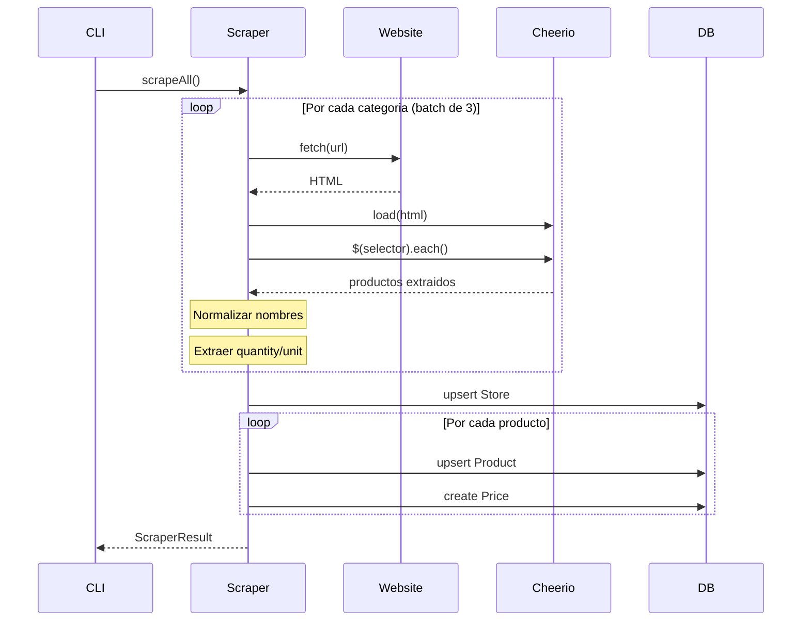

# Como Funciona un Scraper

## Arquitectura General

Cada scraper sigue el mismo patron:

```
Scraper
  ├── config/         # Configuracion (selectores, rutas)
  ├── scrapeRoute()   # Scrapear una categoria
  ├── scrapeAll()     # Scrapear todas las categorias
  ├── scrapePage()    # Scrapear una pagina
  ├── parseHtml()     # Parsear HTML con Cheerio
  └── saveProducts()  # Guardar en base de datos
```

## Flujo de Ejecucion



## Estructura de Archivos

```
src/scrapers/
├── config/
│   ├── superseis.ts    # Configuracion de Superseis
│   ├── stock.ts        # Configuracion de Stock
│   └── categories.ts   # Enum de categorias estandar
└── supermercados/
    ├── superseis.ts    # Implementacion
    ├── stock.ts
    └── ...
```

## Configuracion de Scraper

Cada scraper tiene un archivo de configuracion con:

```typescript
// src/scrapers/config/superseis.ts

export const superseisConfig = {
  name: 'Superseis',
  slug: 'superseis',
  baseUrl: 'https://www.superseis.com.py',

  // Selectores CSS
  selectors: {
    productContainer: '.product-item',
    name: '.product-title',
    nameAttr: 'title',           // Atributo alternativo
    priceNew: '.price-new',
    priceOld: '.price-old',
    discountPercent: '.discount',
    image: '.product-image img',
    url: '.product-link',
    saleType: '.sale-type',
    productId: '[data-product-id]',
    lastPage: '.pagination a:last-child',
  },

  // Funciones de parsing
  parsePrice: (text: string): number | null => {
    // "Gs. 15.000" -> 15000
    const cleaned = text.replace(/[^\d]/g, '')
    return cleaned ? parseInt(cleaned, 10) : null
  },

  parseDiscount: (text: string): number | null => {
    // "-20%" -> 20
    const match = text.match(/(\d+)/)
    return match ? parseInt(match[1], 10) : null
  },

  extractPageNumber: (url: string): number => {
    const match = url.match(/page=(\d+)/)
    return match ? parseInt(match[1], 10) : 1
  },

  // Rutas/categorias a scrapear
  routes: {
    lacteos: {
      path: '/categoria/lacteos',
      category: 'lacteos',
    },
    bebidas: {
      path: '/categoria/bebidas',
      category: 'bebidas',
    },
    ofertas: {
      path: '/ofertas',
      category: 'ofertas',
    },
    // ...
  },
}
```

## Implementacion del Scraper

```typescript
// src/scrapers/supermercados/superseis.ts

export class SuperseisScraper {
  private config = superseisConfig

  // Scrape una categoria completa
  async scrapeRoute(routeKey: RouteKey): Promise<ScraperResult> {
    const route = this.config.routes[routeKey]
    const allProducts = []

    // Primera pagina
    const { products, totalPages } = await this.scrapePage(url, route.category)
    allProducts.push(...products)

    // Paginas adicionales
    for (let page = 2; page <= totalPages; page++) {
      const { products } = await this.scrapePage(`${url}?page=${page}`, route.category)
      allProducts.push(...products)
      await this.delay(300) // Delay entre paginas
    }

    return { data: allProducts, ... }
  }

  // Scrape todas las categorias en batches de 3
  async scrapeAll(): Promise<ScraperResult> {
    const BATCH_SIZE = 3
    const BATCH_DELAY_MS = 500

    for (let i = 0; i < routes.length; i += BATCH_SIZE) {
      const batch = routes.slice(i, i + BATCH_SIZE)

      // Ejecutar batch en paralelo
      const results = await Promise.all(
        batch.map(route => this.scrapeRoute(route))
      )

      // Delay entre batches
      await this.delay(BATCH_DELAY_MS)
    }
  }

  // Parsear HTML de una pagina
  parseHtml(html: string, sourceUrl: string, category: string) {
    const $ = cheerio.load(html)
    const products = []

    $(selectors.productContainer).each((_, element) => {
      const $el = $(element)

      const name = $el.find(selectors.name).text().trim()
      const price = this.config.parsePrice($el.find(selectors.priceNew).text())

      if (!name || !price) return

      products.push({
        name,
        price,
        oldPrice: this.config.parsePrice($el.find(selectors.priceOld).text()),
        imageUrl: $el.find(selectors.image).attr('src'),
        sourceUrl: $el.find(selectors.url).attr('href'),
        category,
      })
    })

    // Detectar total de paginas
    const totalPages = this.extractTotalPages($)

    return { products, totalPages }
  }

  // Guardar en base de datos
  async saveProducts(products: ScrapedProduct[]) {
    // Upsert store
    const store = await db.store.upsert({
      where: { slug: this.slug },
      update: { lastScrapedAt: new Date() },
      create: { name: this.name, slug: this.slug, ... },
    })

    for (const product of products) {
      const normalizedName = this.normalizeName(product.name)

      // Upsert product
      const dbProduct = await db.product.upsert({
        where: { storeId_normalizedName: { storeId: store.id, normalizedName } },
        update: { name: product.name, ... },
        create: { name: product.name, normalizedName, storeId: store.id, ... },
      })

      // Create price record
      await db.price.create({
        data: { price: product.price, productId: dbProduct.id, storeId: store.id },
      })
    }
  }

  // Normalizar nombre
  private normalizeName(name: string): string {
    return name
      .toLowerCase()
      .normalize('NFD')
      .replace(/[\u0300-\u036f]/g, '')  // Remover acentos
      .replace(/[^a-z0-9\s]/g, '')       // Solo alfanumerico
      .replace(/\s+/g, ' ')               // Normalizar espacios
      .trim()
  }
}
```

## Normalizacion de Nombres

La normalizacion es crucial para el matching. El proceso:

1. **Minusculas**: "COCA-COLA" → "coca-cola"
2. **Remover acentos**: "lácteos" → "lacteos"
3. **Solo alfanumerico**: "coca-cola 2l" → "coca cola 2l"
4. **Normalizar espacios**: "coca  cola" → "coca cola"

```typescript
function normalizeProductName(name: string): string {
  return name
    .toLowerCase()
    .normalize('NFD')
    .replace(/[\u0300-\u036f]/g, '')
    .replace(/[^a-z0-9\s]/g, ' ')
    .replace(/\s+/g, ' ')
    .trim()
}
```

## Extraccion de Medidas

Los scrapers pueden extraer cantidad y unidad del nombre:

```typescript
function parseProductName(name: string): {
  baseName: string
  quantity: number | null
  unit: string | null
} {
  // Patrones soportados:
  // - "2L", "2l", "2 L"
  // - "500ml", "500 ml"
  // - "1kg", "1 kg", "1 kilo"
  // - "6 unidades", "x6"

  const patterns = [
    /(\d+(?:[.,]\d+)?)\s*(ml|l|lt|litro|litros)\b/gi,
    /(\d+(?:[.,]\d+)?)\s*(g|gr|kg|kilo|kilos)\b/gi,
    /(\d+)\s*(un|unid|unidades)\b/gi,
    /\bx(\d+)\b/gi,
  ]

  // Extraer y normalizar unidad
  // l, lt, litro → "l"
  // ml → "ml"
  // kg, kilo → "kg"
  // g, gr → "g"
  // un, unid → "un"
}
```

## CLI del Scraper

Cada scraper puede ejecutarse standalone:

```bash
# Dry run (no guarda)
npm run scrape:superseis

# Solo ofertas
npm run scrape:superseis -- --ofertas

# Guardar en DB
npm run scrape:superseis:save

# Categoria especifica
npm run scrape:superseis -- --route=lacteos
```

## Tipos

```typescript
// src/types/index.ts

interface ScrapedProduct {
  name: string
  price: number
  oldPrice?: number
  discountPercent?: number
  imageUrl?: string
  sourceUrl?: string
  unit?: string
  externalId?: string
  barcode?: string
}

interface ScraperResult<T = ScrapedProduct> {
  success: boolean
  data: T[]
  errors: string[]
  scrapedAt: Date
  duration: number
}
```
