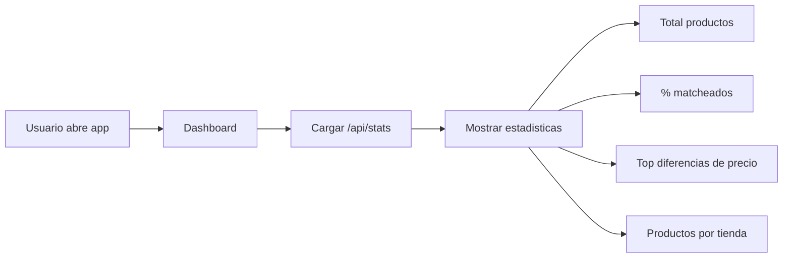
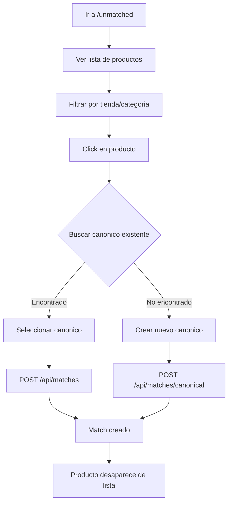
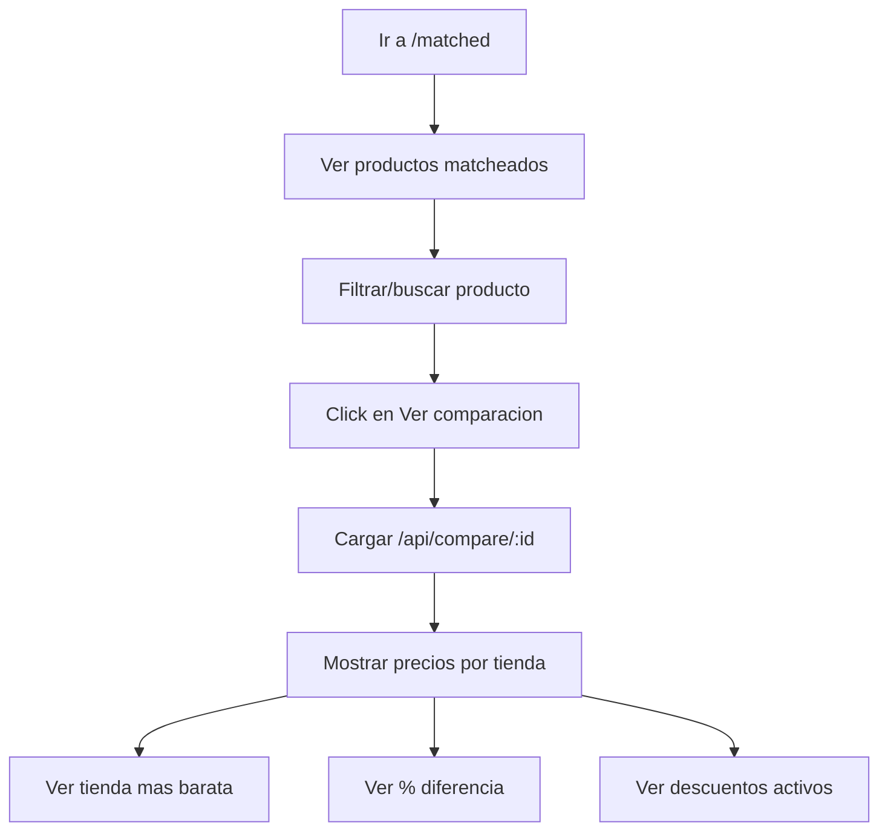
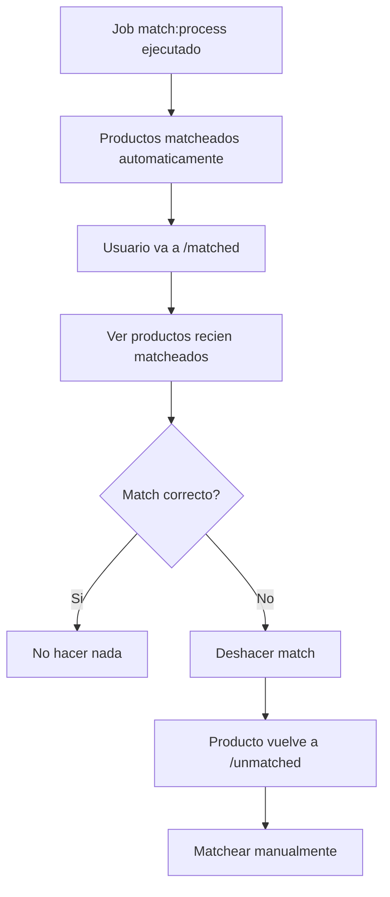

# Frontend - Flujos de Usuario

## Flujo 1: Ver Estadisticas (Dashboard)



**Pasos:**
1. Usuario abre la aplicacion
2. Se muestra el Dashboard automaticamente
3. Se carga estadisticas desde `/api/stats`
4. Usuario ve:
   - Total de productos en el sistema
   - Porcentaje de productos matcheados
   - Productos con mayor diferencia de precio entre tiendas
   - Cantidad de productos por tienda

---

## Flujo 2: Matchear Producto Manualmente



**Pasos detallados:**

1. **Navegar a productos sin match**
   - Click en "Unmatched" en el menu
   - Se carga lista desde `/api/products/unmatched`

2. **Filtrar productos**
   - Seleccionar tienda (Superseis, Stock, etc.)
   - Seleccionar categoria (bebidas, lacteos, etc.)
   - Buscar por nombre

3. **Seleccionar producto**
   - Click en un producto de la lista
   - Se abre modal de matching

4. **Buscar canonico existente**
   - Escribir nombre del producto
   - Se busca en `/api/matches/canonical/search`
   - Ver resultados con porcentaje de similitud

5. **Opcion A: Matchear con existente**
   - Seleccionar canonico de la lista
   - Click en "Matchear"
   - Se envia POST a `/api/matches`

6. **Opcion B: Crear nuevo canonico**
   - Click en "Crear nuevo"
   - Ingresar nombre, categoria, marca
   - Se envia POST a `/api/matches/canonical`

7. **Resultado**
   - Modal se cierra
   - Producto desaparece de la lista
   - Notificacion de exito

---

## Flujo 3: Comparar Precios



**Pasos detallados:**

1. **Navegar a productos matcheados**
   - Click en "Matched" en el menu
   - Se carga lista desde `/api/products/matched`

2. **Buscar producto**
   - Filtrar por categoria
   - Buscar por nombre (ej: "coca cola")
   - Ordenar por diferencia de precio

3. **Ver comparacion**
   - Click en producto o boton "Comparar"
   - Se abre pagina de comparacion
   - Se carga datos de `/api/compare/:canonicalId`

4. **Analizar precios**
   - Ver lista de tiendas ordenada por precio
   - Identificar tienda mas barata (resaltada)
   - Ver porcentaje de diferencia
   - Ver si hay descuentos activos

---

## Flujo 4: Revisar Matching Automatico



**Pasos:**
1. Job de matching automatico se ejecuta
2. Usuario revisa productos matcheados
3. Identifica matches incorrectos
4. Deshace match (producto vuelve a unmatched)
5. Realiza match manual correcto

---

## Componentes de UI por Flujo

### Dashboard
```
┌─────────────────────────────────────────────┐
│ Dashboard                                    │
├─────────────────────────────────────────────┤
│ ┌─────────┐ ┌─────────┐ ┌─────────┐        │
│ │ 10,000  │ │  85%    │ │   6     │        │
│ │Products │ │ Matched │ │ Stores  │        │
│ └─────────┘ └─────────┘ └─────────┘        │
│                                             │
│ Top Price Differences                       │
│ ┌─────────────────────────────────────────┐│
│ │ Coca-Cola 2L    Stock ₲14.5k  +24%     ││
│ │ Leche La Serenisima  Fortis ₲8k +15%   ││
│ └─────────────────────────────────────────┘│
└─────────────────────────────────────────────┘
```

### Unmatched Products
```
┌─────────────────────────────────────────────┐
│ Unmatched Products                          │
├─────────────────────────────────────────────┤
│ Store: [Superseis ▼]  Category: [Bebidas ▼]│
│ Search: [________________]                  │
├─────────────────────────────────────────────┤
│ ┌───────────────────────────────────────┐  │
│ │ [img] COCA COLA ORIGINAL 2LT          │  │
│ │       Superseis │ Bebidas │ ₲15.000   │  │
│ │                              [Match]  │  │
│ └───────────────────────────────────────┘  │
│ ┌───────────────────────────────────────┐  │
│ │ [img] PEPSI BLACK 1.5L                │  │
│ │       Superseis │ Bebidas │ ₲12.000   │  │
│ │                              [Match]  │  │
│ └───────────────────────────────────────┘  │
├─────────────────────────────────────────────┤
│ Page 1 of 30  [<] [1] [2] [3] ... [>]      │
└─────────────────────────────────────────────┘
```

### Match Dialog
```
┌─────────────────────────────────────────────┐
│ Match: COCA COLA ORIGINAL 2LT          [X] │
├─────────────────────────────────────────────┤
│ Search canonical: [coca cola 2l______]      │
│                                             │
│ Results:                                    │
│ ○ Coca-Cola Original 2L (95% match)        │
│ ○ Coca-Cola Zero 2L (82% match)            │
│ ○ Coca-Cola Original 1.5L (78% match)      │
│                                             │
│ ─────────────────────────────────────────  │
│ Or create new:                              │
│ Name: [Coca-Cola Original 2L_____]          │
│ Category: [Bebidas ▼]                       │
│                                             │
│        [Cancel]  [Create & Match]  [Match]  │
└─────────────────────────────────────────────┘
```

### Price Comparison
```
┌─────────────────────────────────────────────┐
│ Coca-Cola Original 2L                       │
│ Bebidas │ 5 tiendas │ Diferencia: 24%       │
├─────────────────────────────────────────────┤
│ ┌─────────────────────────────────────────┐│
│ │ 🏆 Stock        ₲14.500  (-10%)  BEST! ││
│ │    Superseis    ₲15.000               ││
│ │    Casa Rica    ₲15.500               ││
│ │    Fortis       ₲16.000               ││
│ │    Biggie       ₲18.000               ││
│ └─────────────────────────────────────────┘│
│                                             │
│ Ahorro maximo: ₲3.500 (24%) vs Biggie      │
└─────────────────────────────────────────────┘
```
