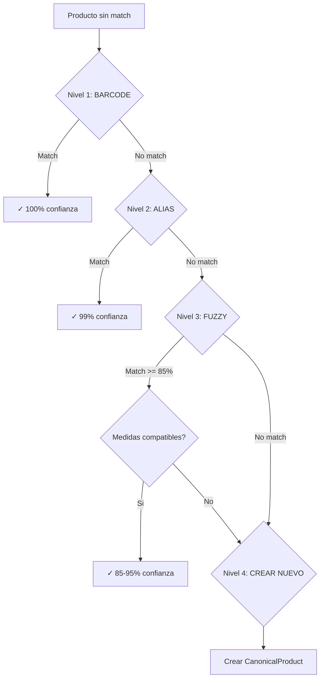

# Sistema de Matching - Como Funciona

## Problema a Resolver

El mismo producto fisico tiene diferentes nombres en cada tienda:

| Tienda | Nombre del producto |
|--------|-------------------|
| Superseis | COCA COLA ORIGINAL 2LT |
| Stock | Coca Cola Original 2 Litros |
| Fortis | COCA-COLA ORG. 2L |
| Casa Rica | Coca-Cola Original Pet 2L |

Para comparar precios, necesitamos identificar que todos son el mismo producto.

## Solucion: 4 Niveles de Matching



---

## Nivel 1: Match por Barcode (100% confianza)

El barcode (EAN/UPC) identifica univocamente un producto.

```typescript
async function matchByBarcode(product: Product): Promise<CanonicalProduct | null> {
  if (!product.barcode) return null

  return db.canonicalProduct.findUnique({
    where: { primaryBarcode: product.barcode }
  })
}
```

**Ventajas:**
- 100% precision
- Match instantaneo

**Limitaciones:**
- No todos los scrapers obtienen el barcode
- Algunos productos no tienen barcode visible

---

## Nivel 2: Match por Alias (99% confianza)

Un alias es un nombre normalizado previamente asociado a un CanonicalProduct.

```typescript
async function matchByAlias(product: Product): Promise<CanonicalProduct | null> {
  const alias = await db.canonicalAlias.findUnique({
    where: { normalizedName: product.normalizedName },
    include: { canonicalProduct: true }
  })

  return alias?.canonicalProduct ?? null
}
```

**Como se crean aliases:**
1. Match manual crea alias automaticamente
2. Match fuzzy de alta confianza crea alias
3. Match por barcode crea alias con el nombre

**Ejemplo:**
```
CanonicalProduct: "Coca-Cola Original 2L"
  ├── Alias: "coca cola original 2lt"      (de Superseis)
  ├── Alias: "coca cola original 2 litros" (de Stock)
  └── Alias: "coca cola org 2l"            (de Fortis)
```

---

## Nivel 3: Match por Fuzzy (60-95% confianza)

Usa la extension PostgreSQL `pg_trgm` para calcular similitud de strings.

```typescript
async function matchByFuzzy(product: Product): Promise<{ canonical: CanonicalProduct; confidence: number } | null> {

  // Estrategia 1: Buscar por baseNormalizedName (sin medidas)
  if (product.baseNormalizedName) {
    const results = await db.$queryRaw`
      SELECT
        cp.id,
        cp.name,
        cp.quantity,
        cp.unit,
        similarity(cp."baseNormalizedName", ${product.baseNormalizedName}) as similarity
      FROM "CanonicalProduct" cp
      WHERE cp."baseNormalizedName" % ${product.baseNormalizedName}
      ORDER BY similarity DESC
      LIMIT 10
    `

    // Filtrar por medidas compatibles
    for (const match of results) {
      if (areMeasurementsCompatible(product, match)) {
        if (match.similarity >= 0.7) {
          return { canonical: match, confidence: match.similarity + 0.1 }
        }
      }
    }
  }

  // Estrategia 2: Fallback a normalizedName completo
  const results = await db.$queryRaw`
    SELECT ...
    WHERE cp."normalizedName" % ${product.normalizedName}
  `

  if (results[0]?.similarity >= 0.85) {
    return { canonical: results[0], confidence: results[0].similarity }
  }

  return null
}
```

**Como funciona pg_trgm:**
```sql
-- Calcular similitud (0.0 a 1.0)
SELECT similarity('coca cola original', 'coca cola org');
-- Resultado: 0.75

-- Buscar con threshold
SELECT * FROM products WHERE name % 'coca cola';
-- Encuentra todos con similarity >= 0.3 (default)
```

**Validacion de medidas:**
Antes de aceptar un match fuzzy, se valida que las medidas sean compatibles:
- 2L = 2000ml (compatible)
- 2L ≠ 1.5L (incompatible)
- null = null (compatible)
- 2L ≠ null (incompatible)

---

## Nivel 4: Crear Nuevo CanonicalProduct

Si no se encuentra match, se crea un nuevo producto canonico.

```typescript
async function createCanonicalFromProduct(product: Product): Promise<CanonicalProduct> {
  return db.canonicalProduct.create({
    data: {
      name: product.name,
      normalizedName: product.normalizedName,
      baseNormalizedName: product.baseNormalizedName,
      brand: product.brand,
      category: product.category,
      quantity: product.quantity,
      unit: product.unit,
      primaryBarcode: product.barcode,
    }
  })
}
```

El nuevo canonico se convierte en el "representante" del producto. Futuros productos similares se matchearan con este.

---

## Flujo Completo del Job

```typescript
async function processProduct(product: Product, stats: MatchStats): Promise<void> {
  // Ya tiene match verificado? Skip
  const existingMatch = await db.productMatch.findUnique({
    where: { productId: product.id }
  })
  if (existingMatch?.isVerified) {
    stats.skipped++
    return
  }

  // Nivel 1: Barcode
  let canonical = await matchByBarcode(product)
  if (canonical) {
    await createMatch(product, canonical, 'BARCODE', 1.0)
    await createAlias(product.normalizedName, canonical.id)
    stats.barcodeMatches++
    return
  }

  // Nivel 2: Alias
  canonical = await matchByAlias(product)
  if (canonical) {
    await createMatch(product, canonical, 'ALIAS', 0.99)
    stats.aliasMatches++
    return
  }

  // Nivel 3: Fuzzy
  const fuzzyResult = await matchByFuzzy(product)
  if (fuzzyResult && fuzzyResult.confidence >= 0.85) {
    await createMatch(product, fuzzyResult.canonical, 'FUZZY', fuzzyResult.confidence)
    await createAlias(product.normalizedName, fuzzyResult.canonical.id)
    stats.fuzzyMatches++
    return
  }

  // Nivel 4: Crear nuevo
  canonical = await createCanonicalFromProduct(product)
  await createMatch(product, canonical, 'FUZZY', 1.0)
  await createAlias(product.normalizedName, canonical.id)
  stats.newCanonicals++
}
```

---

## Ejecucion

```bash
# Procesar todos los productos sin match
npm run match:process

# Ver estadisticas
npm run match:stats
```

**Output ejemplo:**
```
MATCHING COMPLETED

Total processed: 1500
Barcode matches: 200
Alias matches: 800
Fuzzy matches: 300
New canonicals: 200
Skipped (verified): 0
Errors: 0

Duration: 45.2s

MATCHING SYSTEM STATS

Total products: 10,000
Total matches: 8,500
Canonical products: 5,000
Aliases: 6,500
Multi-store canonicals: 3,000

Matches by type:
  BARCODE: 2,000
  ALIAS: 4,000
  FUZZY: 1,500
  MANUAL: 1,000

Matches by store:
  Superseis: 2000/2500 (80.0%)
  Stock: 1800/2000 (90.0%)
  Fortis: 1500/1800 (83.3%)
```

---

## Diagrama de Entidades

```
┌─────────────┐     ┌──────────────┐     ┌───────────────────┐
│   Product   │────▶│ ProductMatch │────▶│ CanonicalProduct  │
└─────────────┘     └──────────────┘     └───────────────────┘
       │                   │                       │
       │                   │                       │
       ▼                   ▼                       ▼
  normalizedName      matchType            normalizedName
  baseNormalizedName  confidence           baseNormalizedName
  quantity            isVerified           quantity
  unit                                     unit
  barcode                                  primaryBarcode
                                                  │
                                                  │
                                           ┌──────▼──────┐
                                           │CanonicalAlias│
                                           └─────────────┘
                                                  │
                                                  ▼
                                            normalizedName
```
